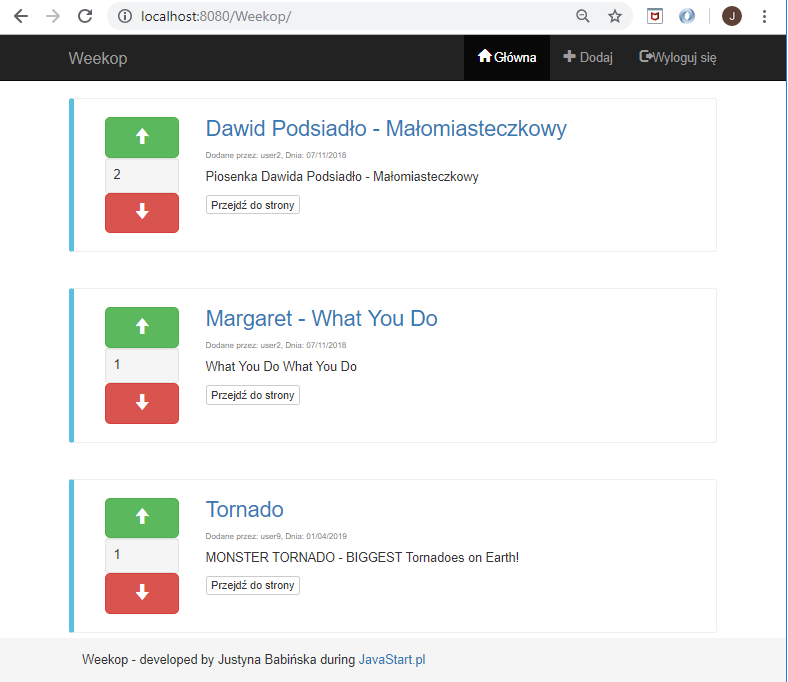
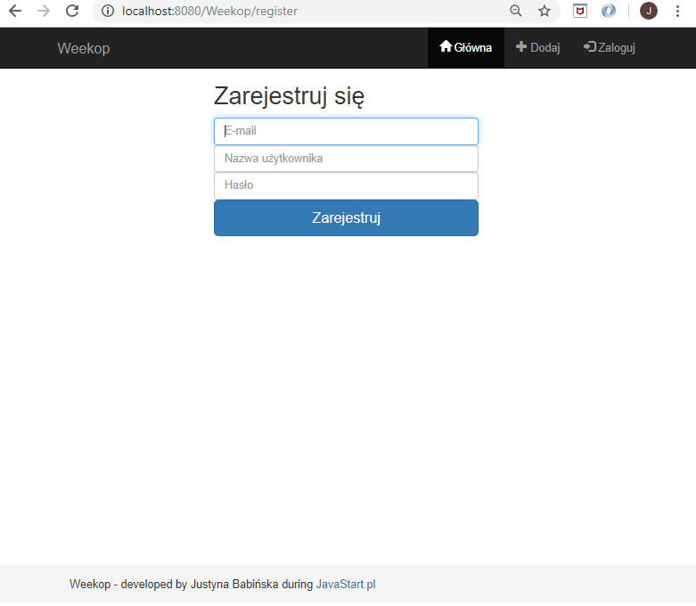
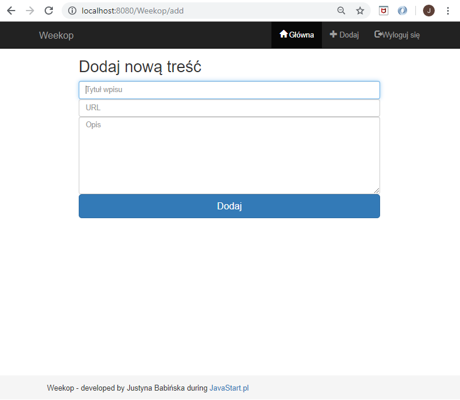

# Weekop
> An internet service similar to the popular site wykop.pl.

## Table of contents
* [General info](#general-info)
* [Screenshots](#screenshots)
* [Technologies](#technologies)
* [Status](#status)

## General info
The application was created to improve knowledge through the training.

Available functionalities:
Users have the opportunity to register and those who log in will be able to add "find".
You can vote on finds, the ones with the highest number are displayed first in the ranking.

## Screenshots

## Technologies
* JavaEE
* Spring JDBC  - version 5.0.8
* Bootstrap - version 3.3.7
* JSTL - version 1.2.5
* Tomcat - version 9.0

## Status
Project is: _finished_
